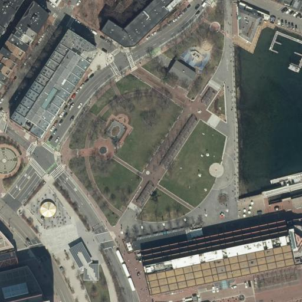

# TiledWebMaps

[](https://opensource.org/licenses/MIT) [](https://pypi.python.org/pypi/tiledwebmaps/)

> A lightweight library for retrieving map images from a [tile provider](https://en.wikipedia.org/wiki/Tiled_web_map) with arbitrary resolution, location and bearing.

## Install

```
pip install tiledwebmaps
```

## Usage

### Example

```python
import tiledwebmaps as twm

# Create a tileloader to access imagery from Massachusetts (MassGIS)
tileloader = twm.Http(
    "https://tiles.arcgis.com/tiles/hGdibHYSPO59RG1h/arcgis/rest/services/orthos2021/MapServer/tile/{zoom}/{y}/{x}",
    twm.Layout.XYZ(), # Common layout used by many tile providers: 256x256 tiles in epsg:3857 projection
    min_zoom=0, # Minimum zoom level specified by MassGIS
    max_zoom=23, # Maximum zoom level specified by MassGIS
)

# Load an aerial image with a given resolution, location and bearing
image = tileloader.load(
    latlon=(42.360995, -71.051685), # Center of the image
    bearing=0.0, # Bearing pointing upwards in the image (= angle measured clockwise from north)
    meters_per_pixel=0.5,
    shape=(512, 512),
)

# Save the image to disk
import imageio
imageio.imwrite("map.jpg", image)
```

The tileloader fetches multiple tiles from [MassGIS](https://www.mass.gov/orgs/massgis-bureau-of-geographic-information) and combines and transforms them to the correct location, bearing and resolution. This creates the following image ([same location in Bing Maps](https://www.bing.com/maps/?cp=42.360995%7E-71.051683&lvl=18.5&style=a)):



A list of tile providers can for example be found at https://osmlab.github.io/editor-layer-index which is maintained by the OpenStreetMaps community. The above parameters for MassGIS are copied from [here](https://github.com/osmlab/editor-layer-index/blob/gh-pages/sources/north-america/us/ma/MassGIS_2021_Aerial.geojson). Please ensure that you comply with the terms of use of the respective tile providers, which may include attribution requirements and rate limits. Some tile providers also charge payment for tile requests. We are not responsible for charges incured when using this library!

Requesting individual tiles from a tile provider for large regions via ``twm.Http`` is slow and puts high demand on the tile provider's servers. If possible, please prefer using bulk download scripts (see [below](#bulk-downloading)).

### Caching

Tiles can be saved on disk to avoid downloading the same tile multiple times:

```python
http_tileloader = twm.Http(
    "https://tiles.arcgis.com/tiles/hGdibHYSPO59RG1h/arcgis/rest/services/orthos2021/MapServer/tile/{zoom}/{y}/{x}",
    twm.Layout.XYZ(),
    min_zoom=0,
    max_zoom=23,
)
cached_tileloader = twm.DiskCached(http_tileloader, "/path/to/map/folder")
```

`cached_tileloader` will check if a tile is already present on disk before calling `http_tileloader`, and store missing tiles after downloading them.

Tiles can also be cached in memory using an [LRU cache](https://en.wikipedia.org/wiki/Cache_replacement_policies#LRU):

```python
cached_tileloader = twm.LRUCached(http_tileloader, size=100)
```

Not all tile providers allow caching or storing tiles on disk! Please check the terms of use of the tile provider before using this feature.

### Bulk downloading

[This folder](https://github.com/fferflo/tiledwebmaps/tree/master/python/scripts) contains scripts for downloading aerial image tiles for regions that provide options for bulk downloading. This is preferred over requesting individual tiles via ``twm.Http`` as it is faster and puts less demand on the tile provider's servers.

```bash
# Example for download_massgis, replace with download_{openbb|opendc|opennrw|opensaxony|nconemap} for other regions

# 1. Install additional dependencies required by the download scripts:
pip install tiledwebmaps[scripts]

# 2. Download script
wget https://github.com/fferflo/tiledwebmaps/blob/master/python/scripts/download_massgis.py

# 3. Run script
python download_massgis.py --path PATH_TO_DOWNLOAD_FOLDER --shape TILESIZE
```

The aerial imagery is downloaded to ``PATH_TO_DOWNLOAD_FOLDER`` and stored as tiles with size ``TILESIZE x TILESIZE``. A tileloader for the downloaded imagery can be instantiated as follows:

```python
import tiledwebmaps as twm
tileloader = twm.from_yaml("PATH_TO_DOWNLOAD_FOLDER")
```